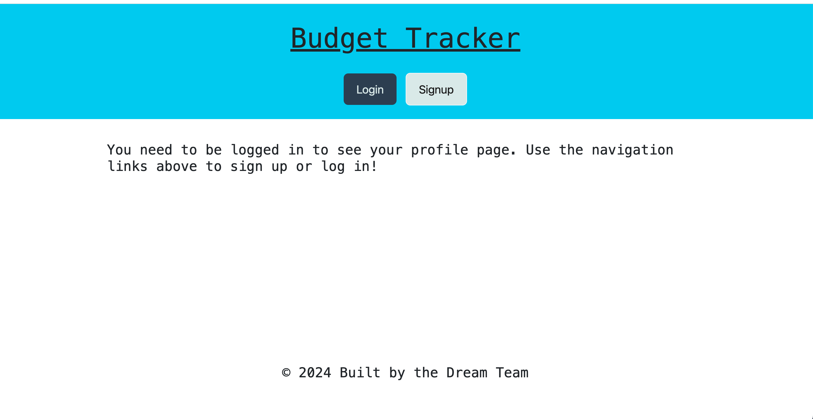
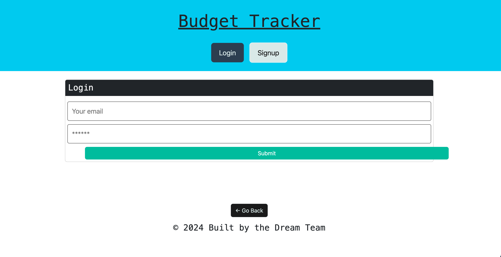
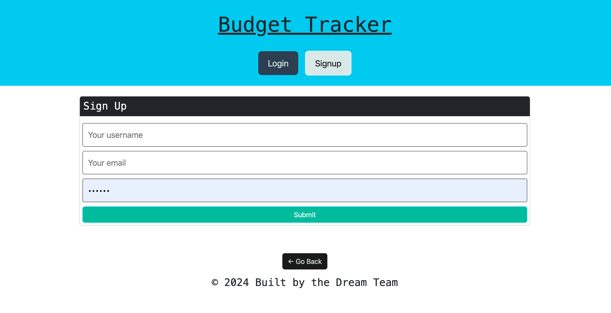
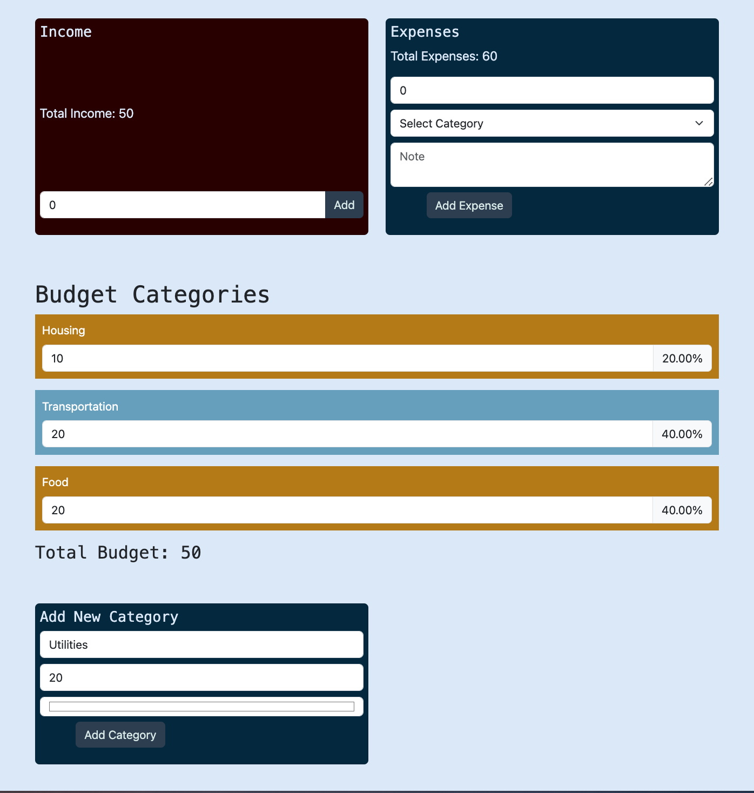

# Budget Tracker 

## Description 

The motivation behind the project was to create a MERN stack budget tracking application so that after signing up and logging in, users can properly manage their expenses by having the option to add their income, expenses and have those expenses divided by specific categories. 
why? We created this application because it allows us to use both the front end (REACT) and backend (for the database) to work together to successfuly create an application that is easy to navigate and utilizes graphQL and well as MONGODB for the database. It solves the problem of being able to create an application that efficiently uses a database (from our models, typedefs and resolvers) that works in tangent with the front end web page so that users can view the data that they've input, as well as edit and delete that data. We learned a lot about creating models for our database, utilizing resolvers and typeDefs, mutations, as well as using REACT to build our pages. We learned how to incorporate our queries and mutations into our front end code. 

## Usage 
Link to deployed webpage on Heroku: https://peaceful-reef-29338-3af1271d806b.herokuapp.com/

Instructions for ![Homepage]: When you click on sign up or sign in, you will be prompted to either sign up or sign in 
Instructions for ![SignUpPage]: When you type in a email, username and password, you are signed up and brought to the budget tracker
Instructions for ![LoginPage]: When you type in your log in info, you are able to log in to see the budget tracker 
Instructions for ![ProfilePage]: When you click the add button on income, you can add your income. When you select a value and category for expenses and click add expense, you will see a new value as well as the categories change corresponding to that. You can also add a new category at the bottom

## Credits 
Nikita Thomas: https://github.com/Nikitaaa95

Yuval Nahmias: https://github.com/YuvNah

Rong Si Deng: https://github.com/rosiedeng1

## License 
Please refer to the LICENSE in the repo